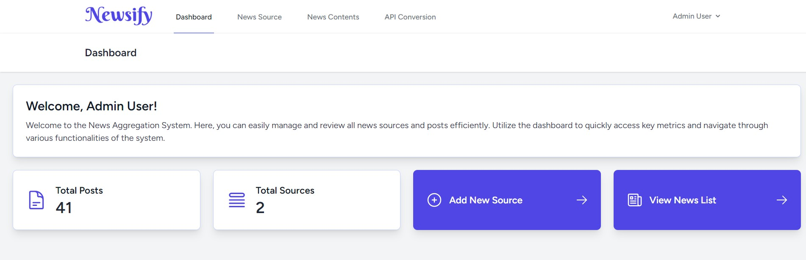
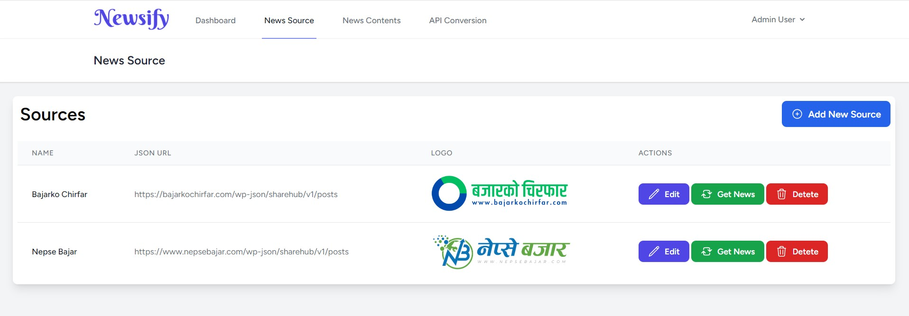
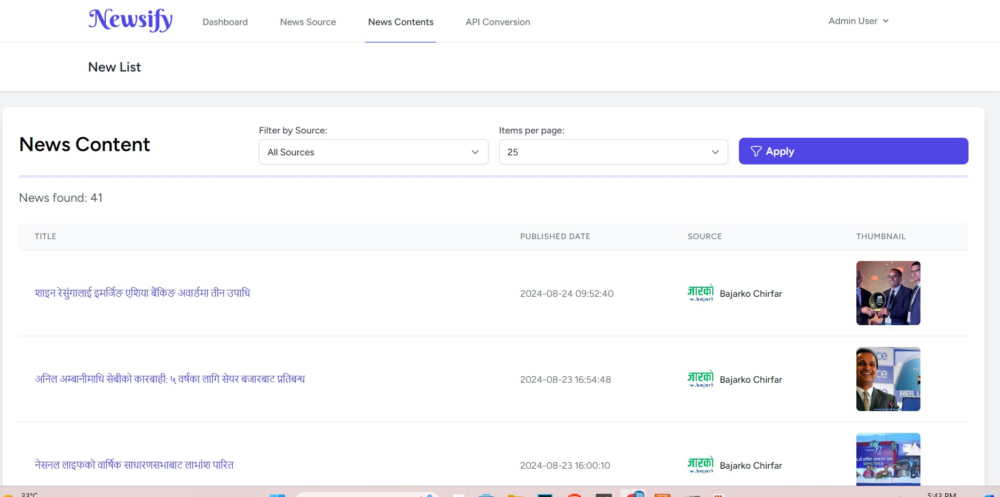
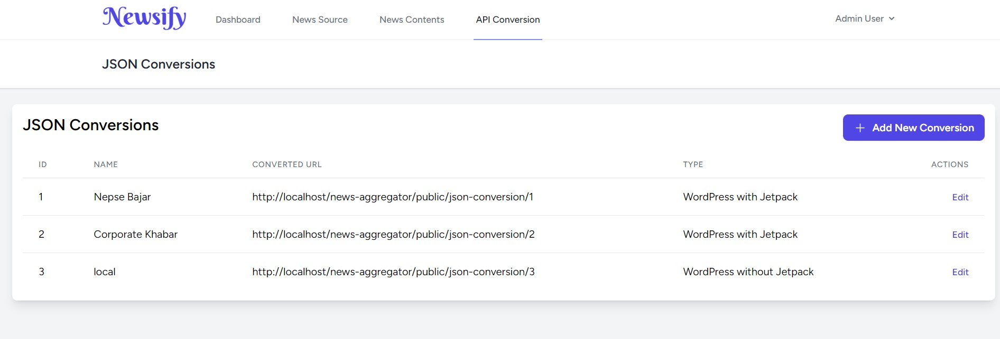
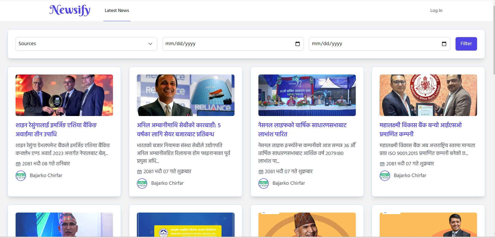

# Newsify


**Newsify** is an open-source Laravel application for aggregating and displaying news. It features a user-friendly admin panel and integrates with a WordPress site to fetch and display news.

## Features

- Simple admin interface
- Fetches news from a WordPress site via a custom API
- Built with Laravel 11 and styled with Tailwind CSS
- SEO-friendly
- Easy to set up and extend

## Installation

Follow these steps to set up Newsify:

### 1. Clone the Repository

Clone the repository to your local machine:

```bash
git clone https://github.com/janak2288/news-aggregator.git
```
 ### 2. Navigate to the Project Directory

Change to the project directory:

```bash
cd news-aggregator
```
### 3. Install Dependencies

Install PHP and JavaScript dependencies:

```bash
composer install
npm install
```
### 4. Set Up Environment Variables

Copy the example environment file and update the configuration:

```bash
cp .env.example .env
```

 ### 5. Generate Application Key

Generate a new application key:

```bash
php artisan key:generate
```

### 6. Run Migrations and Seeders

Run the database migrations and seed the database:

```bash
php artisan migrate --seed
```
The default admin user will be created with the following credentials:

'Email: admin@example.com'
'Password: password'

### 7. Compile Assets

Compile the application's assets:

```bash
npm run dev
```
 ### 8. Serve the Application

Start the Laravel development server:

```bash
php artisan serve
```
## API Integration with WordPress

To integrate Newsify with your WordPress site, add the following code to your `functions.php` file:

```php
function wl_posts() {
    $args = [
        'numberposts' => 20,
        'post_type' => 'post'
    ];

    $posts = get_posts($args);

    $data = [];
    $i = 0;

    foreach ($posts as $post) {
        $data[$i]['title'] = $post->post_title;
        $data[$i]['newsUrl'] = get_permalink($post->ID);
        $data[$i]['thumbnailUrl'] = get_the_post_thumbnail_url($post->ID, 'large');
        $data[$i]['newsOverView'] = get_the_excerpt($post->ID);
        $data[$i]['publishedDate'] = get_the_date('c', $post->ID);
        $i++;
    }

    return $data;
}

add_action('rest_api_init', function() {
    register_rest_route('newsify/v1', 'posts', [
        'methods' => 'GET',
        'callback' => 'wl_posts',
    ]);
});
```


Your API URL will be:' https://your-wordpress-site.com/wp-json/newsify/v1/posts'


## Screenshots

Below are some screenshots of the application:








## Contributing

Feel free to contribute by opening issues or submitting pull requests. Your feedback and contributions are welcome!
## License

This project is licensed under the MIT License. See the [LICENSE](LICENSE) file for details.

## Credits

- **Laravel** - The PHP framework used for this project. [Laravel](https://laravel.com/)
- **Tailwind CSS** - The CSS framework used for styling. [Tailwind CSS](https://tailwindcss.com/)
- **WordPress** - The CMS used for fetching news. [WordPress](https://wordpress.org/)

Special thanks to the open-source community for their contributions to these resources.

